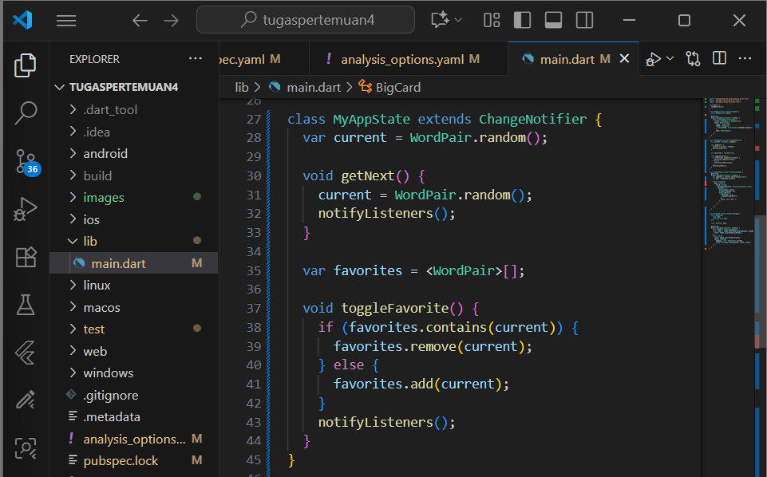
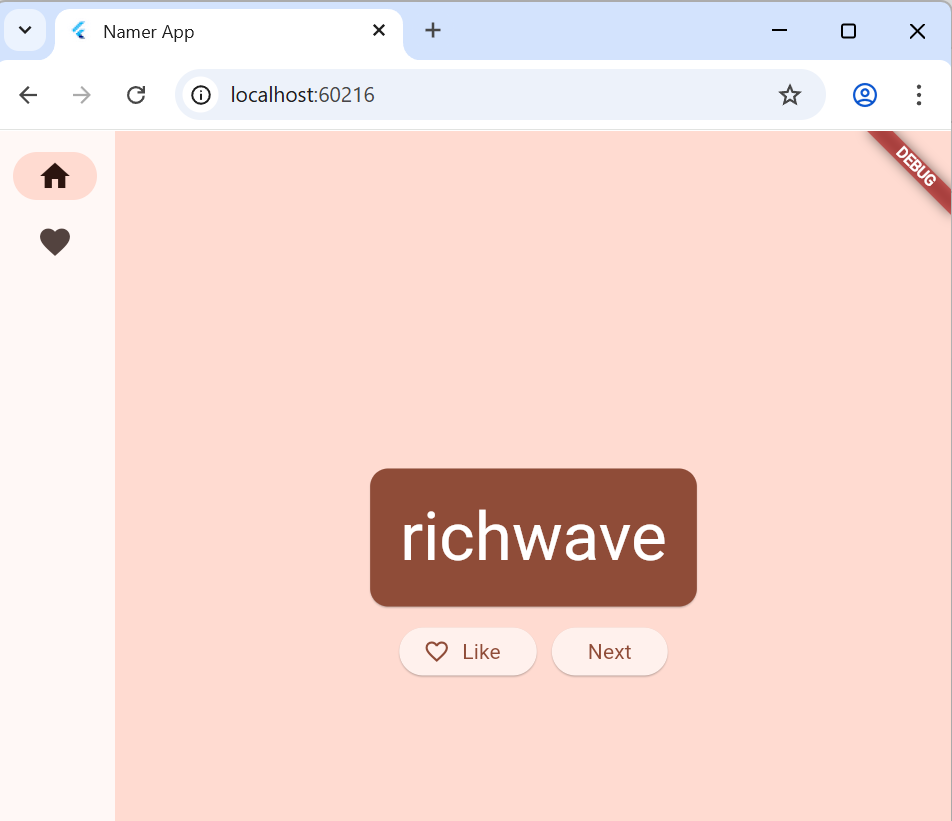

Nama: Indi Warda Ramadhani
 NIM: 2341760026
 Kelas: SIB 3D
 Mata Kuliah: Pemrograman Mobile

Tugas 3 : Create Project

1. Ketik "flutter new". Pilih perintah Flutter: New Project. 

2. Berikutnya, pilih Application lalu folder tempat proyek akan dibuat. Folder ini dapat 
berupa direktori utama Anda, atau direktori seperti C:\src\. 

3. Pada panel sebelah kiri VS Code, pastikan bahwa Penjelajah dipilih lalu buka file 
pubspec.yaml.

Ganti konten file ini dengan kode berikut: 

4. Berikutnya, buka file konfigurasi lainnya dalam proyek tersebut, analysis_options.yaml. 

Ganti konten file tersebut dengan kode berikut: 

5. Terakhir, buka file main.dart pada direktori lib/. 

Ganti konten file ini dengan kode berikut: 

Selagi lib/main.dart terbuka, temukan tombol "play" di pojok kanan atas jendela VS Code lalu klik tombol tersebut.

6. Di bagian bawah lib/main.dart, tambahkan teks pada objek Text pertama lalu simpan (Ctrl+S/Cmd+S). Aplikasi akan langsung berubah tetapi kata acak tetap sama—ini menunjukkan fitur stateful Hot Reload Flutter yang bekerja setiap kali file disimpan.

7. Tambahkan tombol di bawah Text kedua pada `Column`. Simpan file, aplikasi akan ter-update: tombol muncul, dan saat diklik konsol VS Code menampilkan pesan button pressed!."

8. Di MyAppState, tambahkan metode `getNext()` untuk mengisi ulang `current` dengan `WordPair.random()` lalu panggil `notifyListeners()` agar widget yang menggunakan state ikut diperbarui.

9. Terakhir, panggil `getNext()` di callback tombol. Kini setiap menekan Next, aplikasi menampilkan pasangan kata acak baru.

Baris `Text(appState.current.asLowerCase)` sebaiknya diekstrak menjadi widget terpisah agar lebih mudah dikelola. Baris ini tidak perlu akses penuh ke `appState`, cukup menerima pasangan kata saat ini.

10. Tulis ulang `MyHomePage` dengan Extract Widget (Refactor → Extract Widget), beri nama misalnya BigCard, lalu klik Enter.

11. Tindakan ini secara otomatis membuat class baru, BigCard, di akhir file saat ini. Class tersebut akan terlihat seperti berikut: 

Edit class BigCard di metode `build()`. Pada widget `Text`, lakukan Refactor → Wrap with Padding. Setelah disimpan, teks akan dibungkus `Padding` sehingga tampil dengan ruang lebih luas."

12. Ubah padding menjadi 20 untuk ruang lebih luas. Lalu pilih Refactor → Wrap with widget..., ketik Card, tekan Enter. Kini teks berada dalam `Card` dengan padding lebih besar.

Gabungkan `Padding` + `Text` dalam `Card`, lalu beri warna dari Theme agar kartu lebih menarik dan konsisten dengan skema aplikasi.

13. Buat perubahan berikut untuk metode build() BigCard.

Kartu kini berwarna sesuai warna primer aplikasi. Untuk mengubahnya, ubah seedColor pada `ColorScheme` di class MyApp.

14. Perbesar ukuran teks dan ubah warna teks agar lebih kontras dalam metode `build()` `BigCard`.

Posisikan UI di tengah layar aplikasi setelah menampilkan pasangan kata acak dengan gaya visual

15. Ubah alignment Column di build() MyHomePage agar BigCard tidak menempel di atas, misalnya dengan mengatur mainAxisAlignment

Atur mainAxisAlignment Column ke MainAxisAlignment.center agar anak-anaknya berada di tengah vertikal

UI sudah berada di tengah horizontal di dalam Column, tapi Column belum berada di tengah Scaffold; gunakan Widget Inspector untuk memverifikasi.

Kini, aplikasi akan terlihat seperti berikut: 

Hapus teks di atas BigCard untuk tampilan lebih bersih dan tambahkan SizedBox(height: 10) antara BigCard dan ElevatedButton untuk memberi jarak visual.

16. Dengan perubahan opsional, MyHomePage kini memiliki kode yang membuat tampilan aplikasi seperti di bawah ini.

17. Untuk menambahkan logika bisnis, buka `MyAppState` dan tambahkan kode berikut.

Untuk menambahkan tombol, letakkan tombol ‘Like’ di kiri tombol ‘Next’ dengan membungkus keduanya dalam `Row` menggunakan opsi Wrap with Row di `build()` MyHomePage.

UI kembali ke tempat sebelumnya. 

18. Tambahkan tombol kedua di MyHomePage menggunakan `ElevatedButton.icon()` dengan ikon yang disesuaikan berdasarkan status favorit, dan gunakan `SizedBox` untuk memberi jarak antar tombol.

19. Pisahkan MyHomePage menjadi dua widget terpisah dengan mengganti seluruh kode MyHomePage dengan kode baru berikut.

Saat disimpan, Anda akan melihat sisi visual UI telah siap—tetapi tidak bekerja. Mengklik ♥︎ (hati) pada kolom samping navigasi tidak melakukan apa pun.

20. Widget stateful baru hanya perlu melacak satu variabel: selectedIndex. Buat 3 perubahan berikut untuk _MyHomePageState:

21.  Tempatkan kode berikut di bagian atas metode build _MyHomePageState, tepat sebelum return Scaffold:

22.  Sekarang kode Anda dapat memutuskan untuk menampilkan label dengan membuat kueri constraints saat ini atau tidak. Buat perubahan baris tunggal berikut untuk metode build _MyHomePageState: 

23. Berikut salah satu cara membuat halaman favorit yang bisa Anda kembangkan dan ubah sesuai keinginan. Berikut class `FavoritesPage`:

24. Bereksperimenlah lebih lanjut dengan aplikasi yang Anda buat selama menjalani lab ini. 

Jika dihapus 

